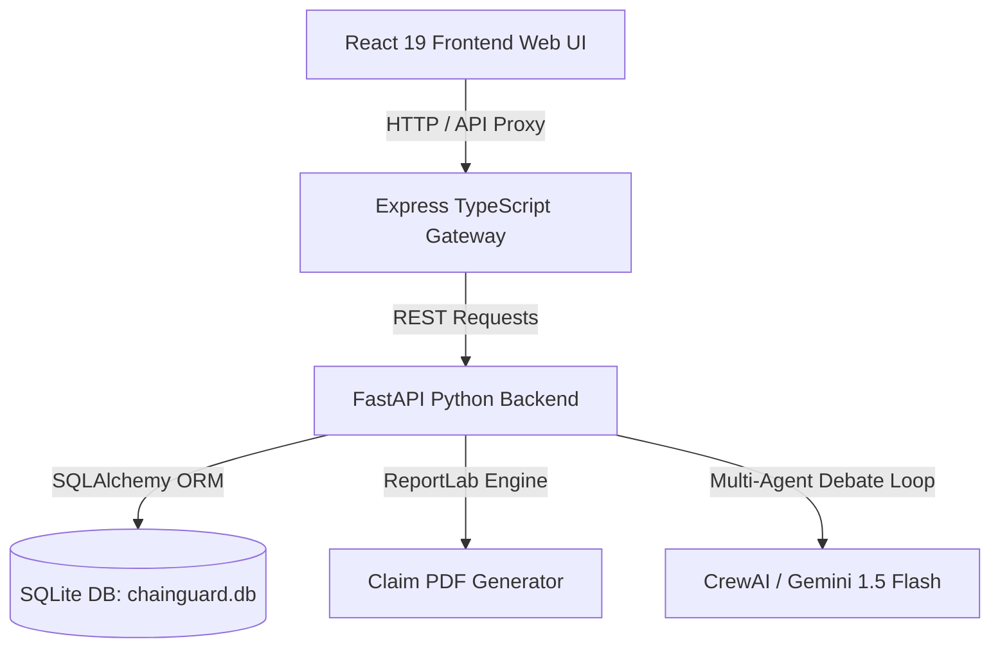

# 🛡️ ChainGuard AI: Perishable Cargo Audit & Compliance Engine

ChainGuard AI is a premium, enterprise-grade cold-chain compliance auditing, dynamic underwriting, and cryptographic verification platform. By merging bio-physical thermodynamics, international maritime/air carriage laws, multi-agent LLM arbitration, and cryptographic auditing, ChainGuard AI ensures trust and mitigates liability across global supply chains.

---

## 🏗️ System Architecture

The application is structured as a decoupled, multi-service architecture:



- **Frontend (React 19 & Vite)**: Live IoT telemetry rendering, carrier performance ledgers, an interactive risk underwriting pricing console, and a drag-and-drop claim document verification portal.
- **Gateway Server (Express & TypeScript)**: Handles client-side routing, static asset serving, and proxies REST API requests to the Python microservice.
- **Audit Engine (FastAPI & Python)**: Enforces scientific calculators, dynamic legal solvers, generates official claim PDF reports, and manages ledger registrations.
- **Database (SQLite)**: Persists audit seals and incoming transport events.

---

## ⚡ Key Technical Features

### 1. Arrhenius Biophysical Spoilage Engine
Enforces optimal temperature profiles and biological spoilage models in python:
- **Cherries / Produce**: Optimal range `[0, 2]`°C. Accumulates shelf-life decay for heat excursions above `2`°C.
- **Bananas / Tropical**: Optimal range `[13, 15]`°C. Chilling excursions below `13`°C trigger Arrhenius-based **chilling injury** decay.
- **mRNA Vaccines / Pharma**: Optimal range `[2, 8]`°C. Excursions above `8`°C trigger decay, whereas freezing breaches below `0`°C trigger an **immediate `TOTAL_LOSS`** state.
- **Telemetry Gap Interpolation**: If a telemetry gap exceeds `2 hours`, the system calculates temperature uncertainty intervals (lower/upper bounds) and flags them in the audit record.

### 2. Dynamic Legal Conventions Solver
Automatically calculates carrier liability caps based on transport mode and gross weight (SDR rate = `1.31 USD`):
- **Air Freight (Montreal Convention Article 22)**: Caps liability at `22 SDR/kg` (~`$28.82 USD/kg`).
- **Ocean Freight (Hague-Visby Rules)**: Caps liability at `2 SDR/kg` (~`$2.62 USD/kg`).
- **PDF Report Customizer**: Sections are dynamically formatted to cite the appropriate treaty, display weights, and outline liability caps.

### 3. Cryptographic Verification & TSA Anchoring
- **canonical Hashing**: Telemetry data arrays and extracted contract SLA terms are sorted and hashed using SHA-256 (`input_seal`).
- **PDF Fingerprinting**: Generated PDF claim reports are hashed to prevent editing or tampering.
- **TSA Ledger Anchoring**: Audit seals are registered in the local ledger database and stamped with a simulated public ledger timestamp block transaction hash (`anchored_tx_id`).
- **Upload Verification**: Compliance officers can drag and drop claim PDFs into the portal to check them against the database ledger (`VERIFIED` vs `TAMPERED`).

---

## 🚀 Getting Started

### Prerequisites
- Node.js (v18+)
- Python (3.10+)

### 1. Setup Environment
Copy the example environment file:
```bash
cp .env.example .env
```
Ensure `DATABASE_URL` is set to `sqlite:///chainguard.db`.
*(Optional: Populate `GEMINI_API_KEY` to enable active CrewAI multi-agent reasoning, otherwise the system falls back to warm deterministic rules.)*

### 2. Install Dependencies
**Node Gateway & UI**:
```bash
npm install
```

**Python Backend**:
Create a virtual environment and install packages:
```bash
python3 -m venv venv
source venv/bin/activate
pip install -r requirements.txt
```

### 3. Running the Servers
Start the FastAPI Backend microservice (Port `8081`):
```bash
./venv/bin/python api.py
```

In a separate terminal, build and start the Express production server (Port `3000`):
```bash
npm run build
npm run start
```
Open `http://localhost:3000` in your web browser.

---

## 🧪 Testing and Validation

### Automated Integration Suite
Run the automated test harness covering masking, sanitization, concurrency, webhooks, biophysics, and tampering checks:
```bash
npx tsx test_harness.ts
```

### Manual Webhook Ingestion
Trigger the simulated TMS webhook simulator to feed mock Vaccine and Banana shipments directly through the Express proxy:
```bash
npx tsx scratch/tms_simulator.ts
```
The audits will immediately appear in the **TMS Integrations** console on the UI.
