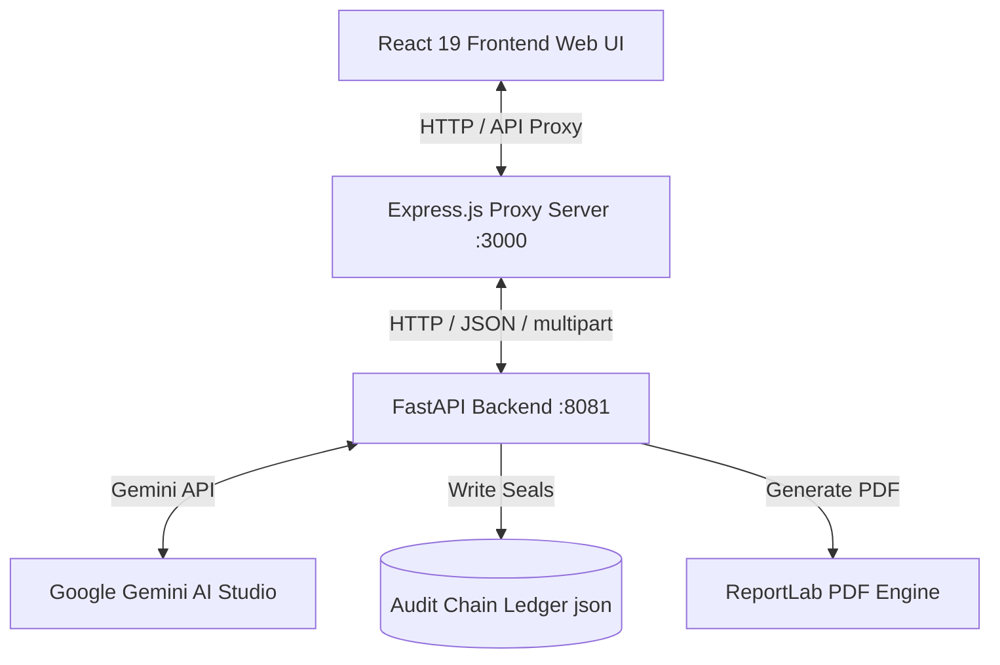

# 🛡️ ChainGuard AI 2.0

> **Legally-Defensible Cold Chain Compliance & Liability Proportional Scoring System**

ChainGuard AI 2.0 is an enterprise-grade smart logistics compliance auditing platform. It monitors perishables (e.g., fresh produce, vaccines, pharmaceuticals, fine wine) in real-time, calculates biological degradation using Arrhenius and $Q_{10}$ thermal models, debates liability allocations through LLM-agent reasoning (Google Gemini), and registers cryptographically sealed claims in an audit ledger.

---

## 🌟 Key Capabilities

1. **Biophysical Spoilage Analysis**
   - Implements real-time kinetic calculations of shelf-life decay (Arrhenius reaction rates and $Q_{10}$ factors).
   - Generates live degradation metrics and alerts during temperature or physical shock breaches.

2. **Multi-Agent Proportional Liability Debate**
   - Employs a multi-agent orchestration (Assessor, Legal, and Dispatcher agents) powered by Gemini to analyze telemetry traces against contract SLAs and allocate liability fault percentages.
   - Provides a Human-in-the-Loop Gateway to override and verify AI liability findings before signing off.

3. **Phase 10: Cryptographic Seal & Compliance Audit Chain**
   - **Data Integrity Stamping**: Generates SHA-256 hashes of telemetry data, contract terms, and final claim PDFs.
   - **Audit Ledger**: Registers claim seals in a secure local database (`audit_chain.json`) to establish a tamper-proof audit chain.
   - **Verification Portal**: Supports drag-and-drop verification of PDF reports, comparing uploaded file signatures against the ledger to highlight authentic files or detect modified bytes (`VERIFIED` vs `TAMPERED`).

4. **Zero-Friction TMS Webhook Ingest**
   - Integrates with modern Transportation Management Systems (TMS) such as CargoWise, Flexport, and SAP LBN.
   - Automatically ingests shipment telemetry, compiles official PDF claim documents, and logs processing histories.

5. **Underwriting Analytics & Premium Engine**
   - Calculates policy premiums dynamically using historical carrier performance scorecards and shipment lane risks.

---

## 🏗️ Architecture & Tech Stack



- **Frontend**: React 19, Recharts, Lucide Icons, Vanilla CSS (Premium Slate/Retro terminal aesthetics).
- **Web Proxy & Server**: Express.js (TypeScript compiled to CJS) serving static assets and proxying requests.
- **Compliance Microservice**: FastAPI (Python) executing biophysical algorithms, multi-agent debates, and ReportLab PDF compilation.
- **Cryptographic Layer**: SHA-256 binary and JSON canonical hashing.

---

## 🚀 Getting Started

### Prerequisites
- **Node.js** (v18+)
- **Python** (3.9+)

### Installation
1. Clone the repository and install the Node dependencies:
   ```bash
   npm install
   ```
2. Configure your environment variables. Create a `.env` file in the root directory (based on `.env.example`):
   ```env
   GEMINI_API_KEY="your-gemini-api-key-here"
   APP_URL="http://localhost:3000"
   ```

### Running the Application

To run the full suite, you need to spin up both the FastAPI backend and the Express frontend proxy.

#### 1. Start the FastAPI microservice
```bash
npm run start:api
```
This runs the Python backend on `http://localhost:8081` using the pre-configured virtual environment (`venv/`).

#### 2. Start the Express development server
```bash
npm run dev
```
Runs the Express server in development mode with hot-reloading at `http://localhost:3000`.

#### 3. Build & Run in Production Mode
```bash
# Build the React bundle and esbuild the Express server
npm run build

# Start the compiled server
NODE_ENV=production npm run start
```

---

## 🧪 Testing & Verification

We have automated test suites to verify system stability, API performance, and security mechanisms:

### 1. Integrity & Concurrency Test Harness
Verifies PII masking, telemetry sanitizers, output guardrails, concurrent API request stability, and cryptographic tamper detection.
```bash
npm run test:harness
```

### 2. Multi-Scenario Model Accuracy Suite
Runs a series of complex logistics event scripts (customs delay, cooling failure, drops) to evaluate CrewAI agent reasoning accuracy and liability score calculations.
```bash
npm run test:accuracy
```

---

## 📂 Project Structure

- `src/` - React frontend application (contains [App.tsx](file:///home/sean/chainguard-ai/src/App.tsx) dashboard).
- `api.py` - FastAPI microservice endpoint handlers (PII masking, SHA-256 seals, ledger).
- `generate_claim_pdf.py` - ReportLab PDF layout generator and seal stamping.
- `liability_scorer.py` - Proportional blame and multi-agent debate logic.
- `server.ts` - Express proxy and static file server.
- `test_harness.ts` - High-fidelity concurrency and verification test suite.
- `eval_suite.py` - Model accuracy evaluation.
